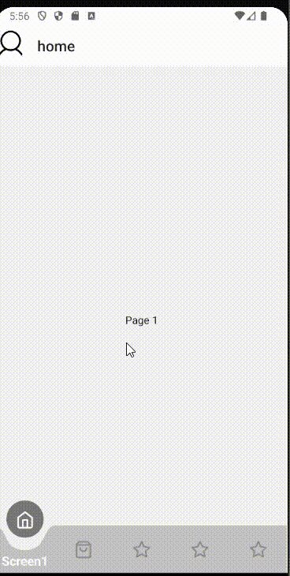
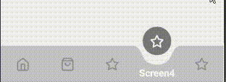

- A react native dynamic animated floating wave in a bottom tab bar navigation, in typescript.
- It can be get a dynamic number of tabs.
- The icons names needs to be belongs to react-native-vector-icons/Feather.

- It comes with a built-in TypeScript typings and is compatible with all popular JavaScript frameworks. You can use it directly or leverage well-maintained wrapper packages that allow for a more native integration with your frameworks of choice.

# Example:




## How to use:

```
import React from 'react';
import { createBottomTabNavigator } from '@react-navigation/bottom-tabs';
import TabBar from './tab-bar/tab-bar';
import { Text, View } from 'react-native';

const Tab = createBottomTabNavigator();

const Screen1 = () => {
  return (
    <View style={{ flex: 1, justifyContent: 'center', alignItems: 'center' }}>
      <Text>Page 1</Text>
    </View>
  );
};
const Screen2 = () => {
  return (
    <View style={{ flex: 1, justifyContent: 'center', alignItems: 'center' }}>
      <Text>Page 2</Text>
    </View>
  );
};
const Screen3 = () => {
  return (
    <View style={{ flex: 1, justifyContent: 'center', alignItems: 'center' }}>
      <Text>Page 3</Text>
    </View>
  );
};
const Screen4 = () => {
  return (
    <View style={{ flex: 1, justifyContent: 'center', alignItems: 'center' }}>
      <Text>Page 4</Text>
    </View>
  );
};
const Screen5 = () => {
  return (
    <View style={{ flex: 1, justifyContent: 'center', alignItems: 'center' }}>
      <Text>Page 5</Text>
    </View>
  );
};

const AnimatedWaveBottomTab = () => {

  return (
    <Tab.Navigator
      initialRouteName="Home"
      tabBar={props => <TabBar {...props} numOfTabs={5} icons={['home', 'shopping-bag', 'star', 'star', 'star']} />}
    >
      <Tab.Group
        screenOptions={{
          headerShown: false,
        }}
      >
        <Tab.Screen options={{ tabBarLabel: 'Screen1' }} name="Screen1" component={Screen1} />
        <Tab.Screen options={{ tabBarLabel: 'Screen2' }} name="Screen2" component={Screen2} />
        <Tab.Screen options={{ tabBarLabel: 'Screen3' }} name="Screen3" component={Screen3} />
        <Tab.Screen options={{ tabBarLabel: 'Screen4' }} name="Screen4" component={Screen4} />
        <Tab.Screen options={{ tabBarLabel: 'Screen5' }} name="Screen5" component={Screen5} />
      </Tab.Group>
    </Tab.Navigator>
  );
};

export default AnimatedWaveBottomTab;
```

#TabBar Props -
BottomTabBarProps &

| Name                  | Type      | Default |
| --------------------- | --------- | ------- |
| numOfTabs             | number    |
| icons                 | string[]  |
| tabBarBackgroundColor | string    |
| lableStyle            | TextStyle |
| iconUnActiveColor     | string    |
| iconActiveColor       | string    |
| circleStyle           | ViewStyle |
